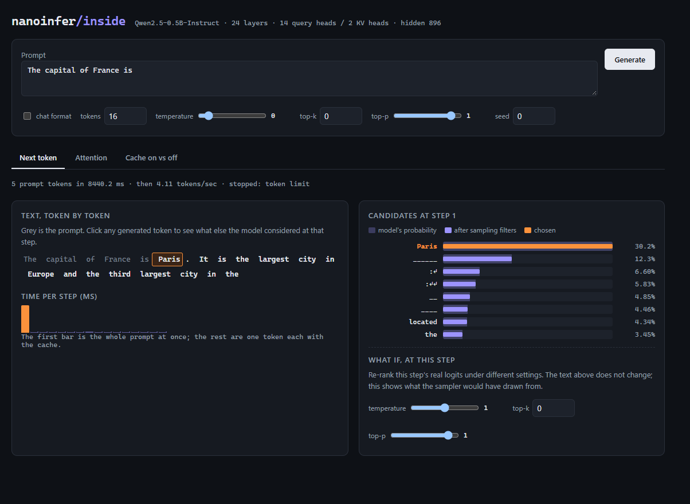
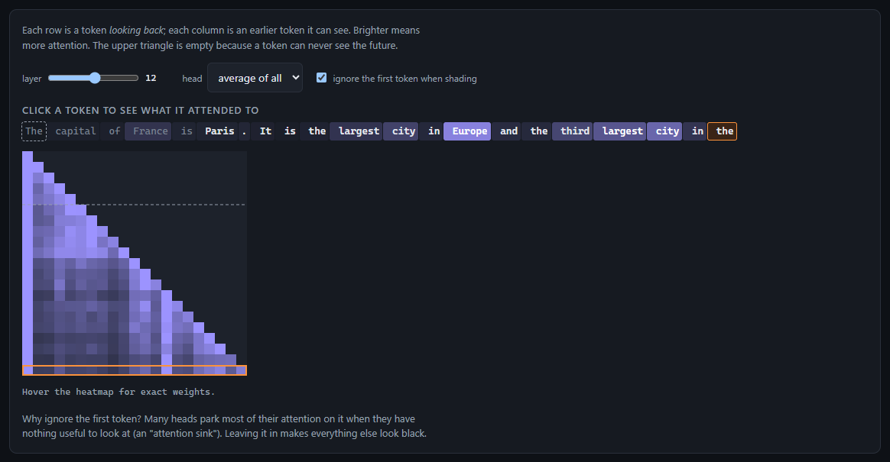
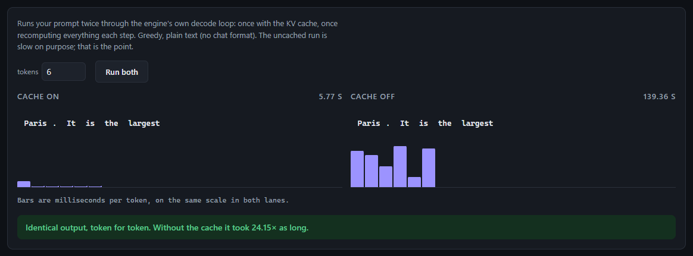

# nanoinfer

An LLM inference engine written from scratch, to understand the layer underneath
the framework.

Target model: **Qwen2.5-0.5B-Instruct**, loaded from its raw `.safetensors` file.
No `transformers`, no `llama.cpp`, no `torch.generate()`. The tokenizer, the
forward pass, the KV cache, the sampler and the quantization are all implemented
here. `torch` and `transformers` appear only in `requirements-dev.txt`, used as
correctness oracles that the tests compare against and that the engine never
imports.

The engine's entire runtime dependency list is `numpy`.

A browser view of the engine's internals, `python -m viz`, shows the candidates
behind every token, attention for any layer and head, and the cache raced
against the uncached path. [More below.](#running-it)



## Status

| Phase | What | State |
|------:|------|-------|
| 1 | Parse safetensors, verify every tensor against the config | **done** |
| 2 | BPE tokenizer, exact round-trip vs. the reference on 10k strings | **done** |
| 3 | float32 forward pass, no cache, greedy; logits within 1e-3 of reference | **done** |
| 4 | KV cache; identical output, measured speedup | **done** |
| 5 | Temperature / top-k / top-p sampling with a seeded RNG | **done** |
| 6 | INT8 then INT4 quantization, perplexity delta at each level | **done** |
| 7 | Rust port: CPU SIMD, then WebGPU compute kernels | **CPU done, wired in, AVX-VNNI**; WebGPU measured and rejected |
| 8 | Benchmark against llama.cpp on identical hardware | **done** — int8 costs +0.13% perplexity to llama.cpp's +0.87%; decode 1.44–1.63× ahead in two clean runs (10/12 and 12/12 paired reps) |

Each phase is verified against a reference implementation before the next one
starts. Correctness first; a fast wrong answer teaches nothing.

## Hardware

All published numbers come from one machine:

| | |
|---|---|
| CPU | Intel i7-12700H, 14 cores / 20 threads, AVX2 |
| RAM | 16 GB |
| GPU | Intel Iris Xe (integrated) — no CUDA |

No discrete GPU, so phase 7 targets **WebGPU via `wgpu`** rather than CUDA or
Metal. That keeps the kernel work real and makes the result runnable on any
reviewer's machine, at the cost of peak throughput.

## Results

Numbers are appended to [`bench/results.jsonl`](bench/results.jsonl) by every
phase and never overwritten, so regressions stay visible.

```
python -m bench.benchmark --compare
```

### Phase 1 — weight loading

| Metric | Value |
|---|---|
| Parameters | 494,032,768 |
| Tensors | 290 |
| File size | 942.3 MiB (bfloat16) |
| `mmap` open | 4.6 ms |
| Widen all weights bf16 → f32 | 6.9 s |
| Peak RSS | 1,392 MB |

Mapping the file is effectively free because nothing is read. The six seconds
are spent paging 942 MiB off disk and doubling it into float32 — which is the
cost that phase 6 exists to attack.

### Phase 2 — tokenizer

| Metric | Value |
|---|---|
| Corpus | 10,000 generated strings, 240,166 characters |
| Token-ID agreement with reference | **10,000 / 10,000 exact** |
| Decode agreement | 10,000 / 10,000 exact |
| Throughput | 52,438 tok/s (pure Python) |
| Reference throughput | 116,038 tok/s (Rust `tokenizers`) |
| Gap | **2.2× slower** |
| Tokenizer load | 1.87 s |
| Peak RSS | 166 MB |

2.2× off a Rust implementation is closer than pure Python has any right to be,
and it is not cleverness in the merge loop — that loop is a deliberately
obvious O(n²) scan. It is the per-pre-token merge cache: real text repeats the
same pre-tokens relentlessly, so almost every lookup after the first thousand
strings is a dict hit.

The corpus averages 1.97 characters per token, which is far below the ~3.5–4 of
natural English. That is the corpus doing its job — a third of it is random
codepoints, control bytes and punctuation runs, which is where tokenizers break.

### Phase 3 — forward pass

Correctness, against `transformers` on the real 494M weights:

| Metric | Value |
|---|---|
| Max absolute logit difference | **6.2e-05** (gate: 1e-3) |
| Argmax agreement | every position, every prompt |
| Generated text vs. reference | token-for-token identical |
| Per-layer drift | flat at ~5e-4 across all 24 layers |

Speed, with no KV cache at all:

| Metric | Value |
|---|---|
| Model load | 2.9 s |
| Time to first token (5-token prompt) | 3,381 ms |
| Decode | **0.25 tok/s** |
| Last token vs. first | 1.26× slower |
| Peak RSS | 3,607 MB |

That 0.25 tok/s is not a disappointing result, it is the baseline. Every step
re-embeds and re-attends over the entire sequence, so the 24th token costs
noticeably more than the first — the 1.26× above is the quadratic cost becoming
visible over just 24 tokens. Phase 4 exists to delete that.

> **These numbers are superseded.** They are a mean over a single cold run, and
> phase 4 established that a single run on this machine can be off by an order
> of magnitude. Re-measured warm, with medians, the same uncached code does
> 3.46 tok/s -- see phase 4. The row is left here rather than edited, because
> the measurement really was taken and the lesson is what it cost.

### Phase 4 — KV cache

Both paths measured by alternating them in one process, three rounds each, same
prompt, same 24 generated tokens:

| | No cache | KV cache |
|---|---:|---:|
| Decode | 3.46 tok/s | **12.06 tok/s** |
| Median step | 288.7 ms | **82.9 ms** |
| Total wall time | 6.39 s | **2.06 s** |
| Time to first token | 200 ms | 152 ms |
| Arithmetic done | 396 positions | **28 positions** |

**Output is identical** — same token IDs, cached and uncached, on all 494M real
parameters across three prompts and every round. Logits agree to 1e-4 rather
than bitwise: the cache changes the shape of every matmul in the model, BLAS
sums the same products in a different order, and float addition is not
associative. Claiming bitwise equality would be claiming something false.

### The speedup is 3.5×, from 14× less arithmetic — and the gap is the point

Those two numbers not matching is the most useful thing phase 4 produced.

Decoding one token reads **every weight in the model** — 1.98 GB — to produce a
single 896-value vector. At 82.9 ms per token that is **24 GB/s effective**,
which is roughly this laptop's DRAM bandwidth. The decode step is not
arithmetic-bound, it is bandwidth-bound: the machine spends its time waiting
for weights, and most of its floating-point capacity sits idle.

So removing 93% of the arithmetic buys only 3.5×, because the arithmetic was
never the constraint. The uncached path was accidentally efficient — it pushed
17 positions through each matmul instead of one, which is exactly what makes a
GEMM worth its memory traffic.

Two consequences worth carrying forward:

- The only way past a bandwidth wall is to move fewer bytes. INT8 halves them,
  INT4 quarters them. That is phase 6, and it is now a bandwidth argument
  rather than a memory-footprint one.
- Serving engines batch many sequences through one weight read for the same
  reason. This engine is single-stream by design, so it leaves that on the
  table knowingly.

The speedup is asserted in tests as **work**, not wall time — positions pushed
through the model, which is exact and deterministic. Timings live in the
benchmark, where the machine that produced them is recorded alongside.

### Measuring on this machine

This laptop produces sporadic multi-second stalls under sustained load. Across
repeats of the *same* generation, totals have ranged from 2.97 s to 17.32 s,
and a single decode step has been 145× slower than the fastest in the same run.

I misread this at first. A matmul sweep showed a 15× cliff at exactly the
prompt length in use, which looked like a BLAS threading pathology worth
writing up. Re-running it twice put the spike at a different size each time —
there is no pathological size, only a noisy machine. The finding was an
artifact, and two more runs were cheaper than publishing it.

What the benchmark does about it:

- **Medians and minima, never means.** One stall makes a mean meaningless.
- **A/B by alternation.** Separate runs are not comparable when throughput
  drifts by more than the effect being measured, so `cache_ab` interleaves both
  paths in one process. Whatever the machine is doing, it does to both.
- **Spread is printed** next to every headline number, so the noise is visible
  instead of averaged into something that looks precise and is not.
- **BLAS thread settings are recorded** with each result. Leaving them unset
  does not mean single-threaded; it means the library chooses, based on the
  machine.

### Phase 5 — sampling

| Check | Result |
|---|---|
| Temperature vs. `TemperatureLogitsWarper` | exact, 7 values |
| Top-k vs. `TopKLogitsWarper` | exact, 200 random vectors incl. forced ties |
| Top-p vs. `TopPLogitsWarper` | exact indices, 400 random vectors |
| Fixed seed reproduces text | identical, real weights |
| Temperature 0 vs. phase 4 greedy | token-for-token identical |

```
seed 1: Once upon a time, there was a small town named Greenfield. The town was known
seed 1: Once upon a time, there was a small town named Greenfield. The town was known
seed 2: Once upon a time, in the year 2000, a group of friends
```

Per-token cost, against the 83 ms decode step from phase 4:

| | |
|---|---:|
| argmax (greedy) | 0.03 ms |
| top-k alone (k=20) | 0.94 ms |
| **top-p alone (p=0.8)** | **22.36 ms** |
| full sampler, temperature → k → p → draw | **7.69 ms** |

The full pipeline is three times faster than top-p on its own. Top-p has to sort
all 151,936 logits, but running top-k first leaves 151,916 of them identical
`-inf`, and the sort is far cheaper on that. The order sampling *has* to run in
turns out to be the fast one too. It is still ~9% of a decode step, and sorting
a whole vocabulary to find a cut near the top is the obvious thing for phase 7
to attack.

### Two formulations that are equal on paper and not in float32

Nucleus sampling is usually described as "sort descending, accumulate, stop when
the sum reaches p." Implementing it that way and differential-testing against
the reference produced disagreements — all of them ties landing on opposite
sides of the cut. For 100 equiprobable tokens at p=0.5 the descending sum
reaches `0.4999997913837433`, a hair under the boundary, so `>= p` keeps one
more token than the reference's `<= 1 - p` on the ascending sum.

Neither is more correct. The implementation follows the reference, because
`top_p=0.8` selecting the same nucleus here as everywhere else is the only thing
a user of that parameter can rely on.

A second, smaller one: sorting must be **stable**. `torch.sort` orders the tied
pair in `[1, 1, 0, 0]` as `[2, 3, 0, 1]`; numpy's default quicksort gives
`[3, 2, 1, 0]`. That changes which token counts as most likely, and a `p` small
enough to keep exactly one keeps the wrong one.

### Two things I measured wrong first

Worth recording because both were confident and both were wrong:

- I asserted a trained model emits no exact float ties, and rested a test on it.
  A real forward pass here produces **about 620 exact float32 collisions** among
  its 151,936 logits. They sit in the low-probability tail, so no realistic
  nucleus boundary falls inside a tied group — but the ties are real.
- Correcting that, I then claimed the 271 untrained embedding rows past the
  tokenizer's vocabulary carry *identical* logits. I had read rounded output.
  They span a band about 6e-3 wide. What actually matters held up: they carry
  under 1e-6 of the probability mass and any truncation removes them, and that
  is now asserted as a number rather than described in prose.

### Phase 6 — quantization

Perplexity on 508 tokens of held-out prose, against an fp32 baseline of 23.2690:

| Level | Footprint | Perplexity | Δ | Weight error |
|---|---:|---:|---:|---:|
| fp32 | 1.98 GB | 23.2690 | — | — |
| **INT8** | **0.90 GB** | **23.3078** | **+0.17%** | 0.85% |
| INT8 + embeddings | **0.50 GB** | 23.3133 | +0.19% | 0.85% |
| INT4, group 32 | 0.77 GB | 30.8070 | +32% | 9.9% |
| INT4, group 128 | 0.73 GB | 35.3849 | +52% | 12.3% |

**INT8 is effectively free** — a 0.17% perplexity cost for a 4× reduction on
the weights it touches. **Naive INT4 is not.** Round-to-nearest with no error
compensation costs half the model's quality, and that gap is precisely what
GPTQ and AWQ exist to close; the number above is what a later attempt would
have to beat.

### Quantization cannot buy speed here, and that is measurable

Phase 4 established that decode is bandwidth-bound: one token reads all 1.98 GB
of weights at ~24 GB/s. Fewer bytes should mean a faster step. It does not,
because NumPy has no integer GEMM:

| Operation (4864×896 weight, M=1) | |
|---|---:|
| fp32 matmul | 0.24 ms |
| int8 → dequantize → matmul | 20.03 ms (**82× slower**) |
| int8 → widen → matmul → scale | 7.38 ms (30× slower) |

Widening the int8 weights costs far more than the matmul it feeds. So phase 6
delivers the **footprint** reduction, which is real, and not the bandwidth win,
which needs a kernel that consumes integers directly — phase 7.

The perplexity figures above therefore come from *simulated* quantization:
weights are quantized and immediately dequantized, so the model computes on
exactly the values the integer format can represent while the matmuls stay
float32. That reproduces the arithmetic of true integer storage exactly, and is
the standard way to measure this (PyTorch calls it a quantize-dequantize pass).

### The measurement changed my mind about embeddings

I excluded the embedding matrix by default, reasoning that it doubles as the
output projection where errors land straight on the logits rather than being
averaged over a hidden dimension first.

That was wrong, and the sweep says so. Quantizing embeddings costs **0.02
percentage points** more and saves another **0.41 GB** — and without them the
untouched embedding matrix dominates what is left, so linear-only gets 1.98 GB
down to 0.90 while including embeddings reaches 0.50. The flag stays, but the
conservative default was the wrong call.

### A bug the sweep caught

`--group-size 32` and `--group-size 128` reported *byte-identical* perplexity.
`quantize_model` was calling the quantizer without forwarding the group size,
so every INT4 run silently used the default. Two configurations agreeing to the
fourth decimal is not a coincidence, and that is what surfaced it. There is now
a regression test asserting the two produce different stored sizes.

### Phase 7 — Rust kernels on the CPU

Phase 6 ended with a footprint win and no speed win: NumPy has no integer GEMM,
so holding int8 and widening per call is 30–80× *slower* than float32. The
kernel that consumes integers directly is what phase 7 builds.

The crate is a cdylib reached over ctypes; the engine is still NumPy and still
runs without it. Per layer, projections only, best of 50, alternating A/B:

| | numpy fp32 | rust 1 thread | rust pooled |
|---|---:|---:|---:|
| busy machine | 1.902 ms | 3.521 ms | **1.562 ms** |
| quiet machine | 0.967 ms | 1.814 ms | **0.762 ms** |
| | — | 0.53× | **1.22× / 1.27×** |

**1.2×, not 10×.** The Rust crate's own benchmark shows 10.28× — against the
crate's own scalar loop, which is a fair baseline for judging SIMD and a
meaningless one for judging the project. The engine never ran a scalar loop; it
ran OpenBLAS on twenty cores, and OpenBLAS is very good. Beating it by 22% with
hand-written AVX2 and a thread pool is the honest result.

Single-threaded loses outright at 0.53×. The SIMD is not what wins here.

### The bug that made parallelism look like a bad idea

Output rows are independent — row *j* reads its own slice of the weights and
writes one float — so splitting them needs no synchronisation at all. The first
implementation of that was **12× slower than one thread**: 1.19 ms against
0.094 ms on a 896×896 matvec.

The decomposition was never wrong. `std::thread::scope` creates real OS threads
at the scope and destroys them at its end, so every call paid to construct
twenty threads for ~90 µs of work. Moving to a pool whose workers already exist
— the only change — took the same code from 3.453 ms to 0.798 ms per layer.

Both kernels are still in the crate. `matvec_i8_spawn_per_call` is tested for
bitwise agreement with the good one, so the benchmark compares two correct
implementations rather than a good one against a broken one.

That is also why the crate has exactly one dependency. A pool whose workers can
borrow the caller's slices needs either unsafe lifetime laundering or rayon's
scope, and the no-dependency version I wrote to avoid it is the 4–7×-slower
column.

### Two projections are slower in Rust, and that is not noise

`k_proj` and `v_proj` measure **0.32×** — a loss — in both runs.

They are 128 rows, about 10 µs of work. The ctypes boundary has a floor of
roughly 8 µs per call, measured on a 1×1 matvec where there is nothing left but
the boundary itself. Below that floor, calling Rust costs more than the work,
and no kernel improvement can fix it; the call has to be made bigger, or not
made at all.

### What phase 7 did not do

The brief says "Rust port". This is not a port — the engine is still NumPy, and
only the seven linear projections cross into Rust. Attention, the norms, RoPE
and the LM head are untouched. Scaled to a token that is 45.7 → 37.5 ms of
projection time, which is a ceiling on what these kernels can move rather than
a token rate.

The int8 projections are now wired into the forward pass — see
[phase 7, finished](#phase-7-finished--int8-in-the-forward-pass) after phase 8,
which is what made it worth doing.

**WebGPU was measured and rejected** — see
[the GPU half](#phase-7-the-gpu-half--measured-and-rejected): the int8 kernel is
a verified compute shader, and on this laptop's Iris Xe it is slower than the
CPU kernel on every shape, so it is not wired into the engine.

### Phase 8 — llama.cpp as a reference

Before timing this engine against llama.cpp, the two have to be computing the
same thing. They are:

| | |
|---|---|
| tokenizer | **5/5** prompts, exact token ids |
| generation | **5/5** prompts, 64 greedy tokens each, exact |

320 consecutive argmax decisions agreeing across two implementations that share
no code. That is not a claim the logits are bitwise equal — they are not, and
phase 3 put the floor on that at ~1e-5 — only that nothing ever moved an
argmax.

**Same weights, not merely the same model.** The GGUF is converted from the
exact safetensors file this engine loads, at f32, by llama.cpp's own
`convert_hf_to_gguf.py`. It lands at 1.98 GB across 290 tensors, which is the
same footprint phase 4 measured, and its 151,387 merges match this tokenizer's
exactly. Downloading a prebuilt GGUF would have smuggled in someone else's
conversion and quantization decisions as an uncontrolled variable.

### The phase 3 bug, in a second engine, by a different route

llama.cpp's `--help` documents `--repeat-penalty` as defaulting to 1.00. Asked
to report what it actually used, it prints:

```
repeat_penalty = 1.100, top_p = 0.800, min_p = 0.050
```

The model file wins. `convert_hf_to_gguf.py` copies `generation_config.json`
into the GGUF metadata, so Qwen2.5's own `repetition_penalty: 1.1` and
`top_p: 0.8` arrive *with the weights* and silently override the flag defaults.
Leaving the flag off changes the continuation from "Paris. It is the largest
city…" to "Paris. It was founded in 789 AD…".

Phase 3 hit precisely this bug from the other side — the transformers reference
diverged until `repetition_penalty` was forced to 1.0. Same trap, different
path, and the reason every sampler that could move an argmax is now pinned
explicitly rather than inherited.

### Phase 8 results — the numbers

Decode, milliseconds per token, each engine at its own best thread count, three
separate measurements:

| | threads | sweep | run 1 | run 2 |
|---|---:|---:|---:|---:|
| nanoinfer f32 | 6 | **121.44** | **161.70** | **152.28** |
| llama.cpp f32 | 3 | 127.30 | 176.49 | 208.06 |
| llama.cpp Q8_0 | 1 | 47.23 | 84.94 | 86.38 |

Absolute numbers drift with how busy the laptop is — they always have here —
but the direction holds every time:

**At f32 the two engines are a tie, with this one marginally ahead** (1.05–1.37×).
That is not a claim to have out-engineered llama.cpp. It is phase 4's thesis
arriving on schedule: decode reads all 1.98 GB of weights to produce one 896-value
vector, so it is bound by memory bandwidth and not by arithmetic. When the wall is
bandwidth, a better kernel cannot help, and OpenBLAS's `sgemv` is already excellent.
f32 is also not llama.cpp's optimized path — essentially nobody runs it that way.

**llama.cpp's real advantage is quantization, 1.8–2.6×.** Q8_0 is 500.79 MiB
against 1884.59 MiB, so it moves a quarter of the bytes, and llama.cpp has
integer kernels that consume them directly. That is exactly the win phase 6
identified and could not collect, and exactly what phase 7's kernels were for —
they are written, tested and 1.22× faster than OpenBLAS, and they are still not
wired into the forward pass. The gap between 152 and 86 ms/token is what
finishing that would be worth. (They are now — see
[phase 7, finished](#phase-7-finished--int8-in-the-forward-pass).)

**llama.cpp wins prefill outright, 2–3×** (22–45 ms/token against 69–77). Prefill
is a compute-bound matmul over the whole prompt, which is the regime where better
kernels do pay. (No longer true either — see below.)

### Where it landed: plain int8, not VNNI

Every decode number above is superseded, and so is the conclusion the first
draft of this section drew. Twelve reps, five engines alternating inside each
rep, each at its own best thread count; the cleanest run recorded, with
llama.cpp 1.06× off its best ever:

| engine | threads | prefill ms/tok | decode ms/tok | decode tok/s |
|---|---:|---:|---:|---:|
| nanoinfer f32 | 6 | 25.61 | 67.19 | 14.88 |
| **nanoinfer int8** | 4 | 9.27 | **23.90** | **41.84** |
| nanoinfer int8 + VNNI | 4 | **8.61** | 24.86 | 40.23 |
| llama.cpp f32 | 3 | 15.19 | 74.32 | 13.46 |
| llama.cpp Q8_0 | 1 | 14.52 | 34.37 | 29.10 |

**Quality: int8 costs less than llama.cpp, and this part is settled.**
Perplexity on the same 2944 held-out tokens, each engine against **its own** f32
baseline because the two harnesses window the text differently and disagree on
absolutes. Perplexity is deterministic, so unlike the timings these figures do
not move with machine load:

| | f32 | quantized | cost |
|---|---:|---:|---:|
| llama.cpp Q8_0 | | | **+0.87%** |
| **nanoinfer int8, f32 activations, f32 embeddings** | 23.6851 | 23.7164 | **+0.13%** |
| nanoinfer int8, f32 activations, int8 embeddings | 23.6851 | 23.7595 | +0.31% |
| nanoinfer int8 + VNNI, scale per 32, LM head f32 | 23.6851 | 23.8286 | +0.61% |

The gap is mostly structural. llama.cpp's Q8_0 kernel quantizes activations to
8 bits so it can use integer dot products; nanoinfer's default path keeps them
in f32 and quantizes only the weights. The VNNI path makes the same trade as
llama.cpp and lands between the two.

**Speed: int8 decodes faster, on an idle machine.** Every run since the
thread-pool fix, decode only, int8 against llama.cpp Q8_0:

| run | control (llama.cpp vs best ever) | int8 lead on minima | paired wins | sign test p |
|---|---:|---:|---:|---:|
| 1 | 1.16× — ok | 1.63× | 10 / 12 | 0.019 |
| 2 | 1.50× — **failed** | 0.89× (llama.cpp ahead) | 4 / 12 | 0.93 |
| 3 | 1.06× — ok | 1.44× | **12 / 12** | 0.0002 |

Both clean runs pass on their own, and in the second every rep favoured int8 —
the worst by 1.09×. The decision rule was fixed before run 3 was taken, which is
what makes it a confirmation rather than a search.

Run 2 is reported because it is the honest limit on the claim. It was taken
with the battery at 19% and charging, and the slowdown was lopsided: int8 went
from 23 to 55 ms/token, 2.4×, while llama.cpp went 1.3×. A matvec split across
four cores loses more to a throttled or busy CPU than one pinned to a single
core does. So the lead is real on an idle, cool laptop and does not survive
contention — which is a property of the engine, not just of the measurement.

```sh
OPENBLAS_NUM_THREADS=6 python -m tools.bench_llamacpp --llama-cpp ../llama.cpp --reps 12
```

Prefill is the other way round from earlier phases: on minima nanoinfer now
leads it too, with VNNI fastest there — though the paired test was only run on
decode, so that is a reading, not a claim. Prefill is a matrix-matrix product, compute-bound
rather than memory-bound, which is exactly where 32-bytes-per-instruction pays.

**What changed between "llama.cpp wins 1.65×" and this:** the Rust thread pool.
Rayon sizes its global pool to every logical CPU — 20 here, 6 fast cores and
8 slow ones — and splitting a memory-bound matvec evenly across them leaves the
fast cores waiting on the slow ones. The same trap phase 8 caught llama.cpp in
with `-t 20`, sprung on this engine instead. A sweep put both int8 kernels best
at four threads; `nanoinfer_set_threads` now sizes the pool at load, and
`NANOINFER_THREADS` overrides it.

An earlier draft of this section reported a 12-of-12 sweep for VNNI at 32.45
ms/token. That was real, but it was the per-row activation scale, which costs
+3.03% perplexity, and it predates the thread-pool fix. It does not describe
anything in the tree now.

### Why one scale per row was the wrong granularity

It is phase 6's per-tensor-versus-per-channel argument arriving on the
activation side, at worse granularity than the case that argument was first
made about. Measured on the real model, one decode step's activations:

| width | max/median \|x\| | per-row error | per-32 error |
|---:|---:|---:|---:|
| 896 | 28.9× | 2.53% | 0.96% |
| 4864 | **68.3×** | 4.97% | 0.90% |

The largest element in a 4864-wide activation vector is 68× the median, so a
per-row scale is set by that one value and the other 4863 share a range 68×
too wide. Blocking confines each outlier to its own 32 values. The perplexity
curve flattens there — one per 128 costs +1.37%, one per 32 costs +0.85%, one
per 16 also +0.85% — which is presumably why llama.cpp's Q8_0 and Q8_1 both use
32. Overhead is one f32 per 32 bytes of activation, and activations are not what
streams from DRAM.

### Two things that were worth more than the kernel

The first blocked version was *slower* than the per-row kernel it replaced, and
neither cause was the arithmetic.

**It allocated three `Vec`s per call.** The blocked matmul runs 97 times per
decoded token, so that was ~300 allocations a token, and it showed as a 4.37×
spread. Activations are now quantized once into flat buffers.

**Both VNNI matmuls were single-threaded.** The float-activation path they were
measured against uses rayon. So every VNNI number recorded before that fix —
32.45 ms/token, the 2.2–2.6× per-shape gains, the 12-of-12 sweep — was **one
core against six**, which makes the instruction-level win larger than it looked
rather than smaller. Rows are independent, so they now split the way
`matmul_i8_parallel` splits them.

### Why the earlier kernel was leaving it on the table

Profiling decode on the real model put **76.6%** of the time inside the int8
kernel — 97 calls per token, with attention, the norms, RoPE and softmax
together under 10%. Python was never the problem. The kernel ran at **6.4 GB/s
against this machine's ~24**, which says compute-bound on *converting* int8 to
float rather than waiting for memory: it widened eight bytes at a time with
`_mm256_cvtepi8_epi32` and did the dot product in floating point.

This CPU reports `avxvnni`. VPDPBUSD takes **thirty-two bytes per instruction**
and accumulates in i32, with no conversion in the inner loop — 2.2–2.6× on the
per-layer projections, 1.39× on the LM head, which at 136M weights is the one
shape genuinely memory-bound rather than instruction-bound. That spread across
shapes is the diagnosis confirming itself.

It also explains how llama.cpp was winning while pinned to `-t 1`: its Q8_0
kernels use the same instruction, so this was never a parallelism gap.

The sign handling is the fiddly part. VPDPBUSD multiplies *unsigned* by
*signed*, and the cheap way to satisfy that is to offset the weights rather than
the activations — `XOR 0x80` reads `i8` as `u8` in order, adding 128 to each:

```
dpbusd(w ^ 0x80, xq) = Σ(w·xq) + 128·Σxq
```

so the correction is **one scalar per call**, because the activation vector is
shared by every row. Offsetting the activations instead would have needed
`128·Σw` — a different value per row, and a second pass over the weights to get
it.

It is **off by default**, because it is not free: VPDPBUSD needs both operands
as bytes, so activations carry 8 bits where they carried 32 — +0.85%
perplexity against an fp32 baseline, where the float-activation path costs
+0.19%. `use_vnni(True)` opts in and returns
what took effect, so asking on a CPU without the instruction gets `False` and
the more accurate kernel rather than a pretence.

### The gate that got this wrong twice

The first version of this comparison had llama.cpp 1.8–2.6× **ahead**. That was
two numbers from different runs on different days — mine at its best against
llama.cpp's from phase 8. Measured in one process, alternating, llama.cpp came
in at 66 rather than 85 and the apparent margin evaporated. The same error as
phase 4's 15× cliff, reintroduced.

The fix after that was also wrong. Gating on `max/min` spread looks prudent and
is unusable: it can only grow as reps are added, so more evidence makes a lead
look *less* certain. Eight reps reported spreads of 1.4–2.2×; twenty reported
4.6–8.6×. Same machine, same code.

What works is the paired test. The contenders already alternate inside each rep,
so every rep is a matched pair under shared conditions, and counting wins is a
sign test — robust to exactly the stalls that move the absolute numbers around.

It is not robust to stalls that hit one contender harder than the other, and
that is how it got this wrong a third time. On a loaded laptop this engine
slowed 1.3× while llama.cpp slowed 3.7×, so every rep favoured this engine and
the test reported a clean sweep on a measurement worth nothing. The fix is a
control: llama.cpp's code never changes between runs, so its own number is a
thermometer for the machine, and a run where it reads more than 1.5× off its
best ever is flagged as not comparable whatever the sign test says.

### Handing your opponent a bad flag is not a benchmark

The first run of this comparison said nanoinfer decoded **2× faster than
llama.cpp**. That is an extraordinary claim, and the ordinary explanation was
the true one: llama.cpp had been given `-t 20`.

This CPU is Alder Lake — 6 fast P-cores and 8 slow E-cores behind 20 logical
threads. Splitting a memory-bound matvec evenly across them leaves the fast
cores waiting on the slow ones:

| threads | Q8_0 | f32 | nanoinfer f32 |
|---:|---:|---:|---:|
| 1 | **47.23** | 270.35 | 209.39 |
| 3 | 102.16 | **127.30** | 170.99 |
| 6 | 103.46 | 211.38 | **121.44** |
| 20 | 264.53 | 278.12 | 181.09 |

A 5.6× swing on Q8_0 from one flag. So both sides are swept, because sweeping
only the opponent would be worse than not sweeping at all — and that turned out
to matter in both directions: this engine's own default of all 20 BLAS threads
was costing it 50%.

### Building llama.cpp on Windows, for whoever needs it next

Four fixes, none of them in llama.cpp's code, all of them specific to a MinGW
build driven from MSYS `make`:

| Symptom | Cause |
|---|---|
| `Cannot create temporary file in C:\WINDOWS` | MSYS `make` strips `TMP`/`TEMP`/`TMPDIR` from every recipe, so GCC falls back to Windows' default of `C:\WINDOWS`, which is not writable |
| same error, but only at link time | `CMAKE_*_COMPILER_LAUNCHER` covers compiling, not linking; `CMAKE_*_LINKER_LAUNCHER` is a separate variable |
| `cpp-httplib doesn't support Windows 8 or lower` | MinGW defaults `_WIN32_WINNT` below `0x0A00`; the OS is fine, the macro is not |
| generation returns an empty string | `--log-disable` suppresses the generated text too, but only when stdout is a pipe — correct by hand, empty from a script |

The first two are solved with a two-line shell wrapper that re-exports a
writable temp directory and `exec "$@"`, passed as both the compiler and the
linker launcher.


### Phase 7, finished — int8 in the forward pass

Phase 8 ended on a number: the gap between 152 and 86 ms/token is what wiring
phase 7's kernels into the forward pass would be worth. They now are.

`quantize_model(..., dequantize=False)` keeps INT8 weights as int8 instead of
rounding them and handing back float32, and every projection in the forward
pass — including the LM head and the embedding lookup — goes through one
function, `linear()`, that sends an fp32 array to BLAS exactly as before and an
int8 tensor to Rust. There is still one forward pass; the weights decide the
route.

**It computes the function phase 6 measured.** The perplexity numbers were
taken on simulated INT8 — the same integers, dequantized. If the stored-int8
model computed something else, those numbers would describe a model nobody
runs. On the tiny model the two agree to 1.3e-7 in the logits, while fp32 sits
3.3e-3 away, so the 1e-5 gate in `tests/test_int8_engine.py` separates "same
function, different summation order" from "a different model" with room on
both sides. Generated tokens are compared exactly. On the real weights that
same check is `test_real_model_int8_generates_what_simulation_does`.

**Prefill is one call per projection, not one per token.** A new batched kernel
puts the loop over tokens *inside* the loop over weight rows, so each row is
read from memory once and stays in L1 while every token is dotted against it.
It shares its per-row dot product with the matvec, so a prompt processed in one
call and the same prompt token by token give identical bits — asserted
bitwise, not to a tolerance.

### Wiring it in made it slower, and the kernel was why

The first whole-model measurement had int8 decoding at **0.42x** the speed of
fp32. Three things were wrong, found in order:

| | int8 + embed, ms/token |
|---|---:|
| as written in phase 7 | 61.9 |
| four accumulators instead of one | 61.0 |
| + software prefetch, 4 KiB ahead | **48.6** |
| fp32, for reference | 52.0 |

*`OPENBLAS_NUM_THREADS=4`, on a 4-core cloud Xeon with synthetic weights of the real shapes, not
on the reference laptop — see below.*

**The micro-benchmark was cache-hot.** `bench_kernels` times one matrix over and
over, and a 4864×896 int8 matrix is 4 MB — it lives in L3 after the first call.
The whole model is 0.5 GB and streams from DRAM every token. Timed that way, cold
across 48 distinct matrices, the kernel moved int8 at ~13 GB/s while OpenBLAS
moved fp32 at ~50 GB/s: a quarter of the bytes, at a quarter of the rate, for no
gain at all.

**One accumulator was a serial chain.** Every FMA waited on the one before it.
Four independent accumulators doubled the cache-hot speed (1.65 → 0.81 ms per
layer, single-threaded) and did nothing for decode — which is how it became
clear the limit had moved to memory.

**Hardware prefetch was not keeping up.** One sequential stream per thread does
not have enough loads in flight to cover DRAM latency. An explicit prefetch,
swept from 512 bytes to 16 KiB, plateaued at 4 KiB ahead: single-threaded cold
streaming went 0.74 → 0.30 ms per gate projection, and the pool 0.33 → 0.21.
OpenBLAS does the same thing; that is most of why it was winning.

These changes alter the kernel the phase 7 table above measured, so that table
is now the *old* kernel; rerun `tools.bench_kernels` for the new one.

### Two thread pools on one CPU

| | `OPENBLAS_NUM_THREADS=4` | `=1` |
|---|---:|---:|
| fp32 | **52.0** | 157.8 |
| int8, LM head fp32 | 72.3 | 87.1 |
| int8 + embed | 48.6 | **45.1** |

`int8` alone — projections in Rust, the 544 MB LM head still in BLAS — is the
worst of both. Each pool's workers spin for a while after finishing, waiting
for more work, and on four cores rayon's spinning threads and OpenBLAS's take
turns starving each other. Quantizing the embeddings removes the only large
BLAS call left, which is why `--int8-embeddings` is not a footnote here: phase 6
measured it at +0.02 percentage points of perplexity, and it is the
configuration where the two pools stop colliding.

### What is not known yet

**These are not reference-machine numbers.** HuggingFace is unreachable from
the environment this was built in, so every timing above uses random weights
with Qwen2.5-0.5B's exact shapes (`--synthetic`), on a 4-core Xeon with 260 MB
of L3, rather than the real weights on the i7-12700H every other table in this
README comes from. Timing depends on shapes, not values, so the *direction*
should carry over; the ratios will not, and the 20-thread Alder Lake with its
P/E-core split is precisely where phase 8 found thread count mattering most. The
real comparison is:

```
python -m tools.bench_int8
OPENBLAS_NUM_THREADS=1 python -m tools.bench_int8
```

The phase 8 target is llama.cpp Q8_0 at ~86 ms/token on that laptop. Whether
this closes it is the open question. What it can already say is that the
remaining ~18 ms per token on the synthetic run is not the kernels — they are
~30 ms of a ~48 ms step — but the NumPy glue around them: SiLU's sigmoid alone
costs 4.5 ms a token, in both paths.

### Prefill, the sigmoid, and the ctypes floor

Three follow-ups to the profile above, each measured on the same 4-core VM
with the same synthetic weights, and none of them changing a single output
bit:

| ms/token | before | after |
|---|---:|---:|
| int8 + embed decode, `OPENBLAS_NUM_THREADS=1` | 45.1 | **40.4** |
| int8 + embed prefill, `OPENBLAS_NUM_THREADS=1` | 13.9 | **8.5** |
| fp32 decode, `OPENBLAS_NUM_THREADS=4` | 52.0 | **47.8** |

**Prefill widens each row once.** The batched kernel re-widened every int8
weight for every token, so a 32-token prompt paid for the conversion 32 times.
It now widens a row into an L1-sized buffer once per block of tokens, walks
tokens in blocks whose activations fit in L2, and dots three tokens per pass
so each weight load feeds three FMAs instead of one. int8 → f32 is exact and
every token keeps its own four accumulator chains in the same order, so a
prompt processed in one call is still bitwise the same prompt processed token
by token — `tests/matmul.rs` now crosses a token-block boundary to prove it.

It is still behind fp32 BLAS on large batches, by 1.8–2.4× per projection at
128 tokens. Closing that needs a GEMM-style microkernel, which sums each
output in a different order from the decode kernel and would give up the
bitwise match; that trade is not made here. One trap while measuring it: this
VM's OpenBLAS picks its AVX-512 `SkylakeX` kernels at runtime, which the i7-12700H
does not have. `OPENBLAS_CORETYPE=Haswell` forces the kernel the laptop would
run, and the per-projection comparison above uses it.

**The sigmoid no longer splits the array.** It computed each sign's half with
boolean masks and scattered the halves back. Both halves share
`e = exp(-|x|)` — the result is `1/(1+e)` on one side and `e/(1+e)` on the
other — so one `np.where` computes the identical expression per element:
bitwise the same, 118 → 27 µs per 4864-wide call, about 2 ms a token. The
fp32 path gets it too.

**The ctypes floor halved.** `data_as()` builds a typed pointer object per
array per call, and it was 40% of an empty call. The engine's entry point now
takes raw addresses (`c_void_p` and `arr.ctypes.data`); `_as_kernel_input`
already enforces dtype and contiguity on the Python side. An empty call went
11.9 → 5.6 µs, which at 169 calls a token is about 1 ms.

### Seven calls a layer become four

Q, K and V all read the same activations, and so do gate and up. When
`quantize_model(dequantize=False)` stores each group's int8 rows back to back
in one buffer, the group already *is* one matrix, and `linear_many` runs it as
a single kernel call over all of its rows and splits the result. Each output
row is its own dot product, so the one call returns exactly the bits the
separate calls did — asserted bitwise. fp32 weights, and int8 weights stored
apart, take the separate calls as before.

| int8 + embed, `OPENBLAS_NUM_THREADS=1` | decode, ms/token | prefill, ms/token |
|---|---:|---:|
| separate calls | 46.1 / 50.5 | 9.1 / 9.7 |
| fused | **40.9 / 40.7** | 9.2 / 9.0 |

*Alternating A/B in one process, run twice with the order swapped.*

That is 10–20% of decode, far more than the ~0.4 ms the 72 saved ctypes
crossings account for. The rest is the pool: every call wakes rayon's workers
and joins them again, and K and V were 128 rows each — 32 rows per thread on
four cores, almost nothing but the wakeup and the join. Prefill moves the same
weights and does the same arithmetic either way, and does not change.

### Phase 7, the GPU half — measured and rejected

The int8 matmul now exists as a WebGPU compute shader, in its own crate,
`gpu/`. The CPU crate keeps its one dependency and its seconds-long build;
wgpu is a graphics stack, and nothing that uses the CPU kernels should have
to compile it.

**What it does.** A `GpuMatrix` is uploaded once and stays resident, so a
decode step moves only the 896 activations up and the outputs back; moving
the weights per token would throw away the point. WGSL has no 8-bit type, so
each row goes up packed four int8 to a `u32`, and `extractBits` on an `i32`
sign-extends them back. int8 → f32 is exact, so the shader multiplies exactly
the integers the CPU kernel does. One workgroup of 64 threads computes one
output: each thread sums a strided slice of the row, a tree in workgroup
memory folds the 64 partial sums, and the scale is applied once at the end.

**Verified against the CPU kernel**, not to the bit — the shader adds in a
different order (64 slices, then a tree) from the CPU's four chains of eight
lanes, and float addition does not associate — but to float32 tolerance, on
every decode shape, a batch of tokens, widths that need padding to a multiple
of four, and a hand-worked case. A shader with its scale off by 0.1% fails
the tests, so the tolerance has teeth.

**Two limits the LM head runs into.** WebGPU caps a dispatch at 65,535
workgroups per dimension and the LM head has 151,936 rows, so rows run along
x and wrap into y. And a device may cap one storage binding at 128 MiB —
Mesa's llvmpipe does — while the int8 LM head is 130 MiB, so a large matrix
is uploaded as row chunks that each fit, one dispatch per chunk in a single
submission, each writing its own rows of the shared output. Both have tests:
70,000 rows for the wrap, and a matrix forced into seven uneven chunks that
must match the same matrix uploaded whole.

**How fast it is: slower than the CPU, everywhere.** The tests were first run
on llvmpipe, Mesa's software Vulkan driver, which is right for checking the
arithmetic and meaningless for timing it. On the Iris Xe all six pass, and the
benchmark says:

```
cd gpu && cargo test --release && cargo run --release --example bench
```

| shape | cpu ms | gpu ms | gpu / cpu |
|---|---:|---:|---:|
| q_proj 896×896 | 0.047 | 0.574 | 12.13× |
| kv_proj 128×896 | 0.007 | 0.523 | 76.87× |
| o_proj 896×896 | 0.126 | 0.643 | 5.10× |
| gate 4864×896 | 0.172 | 0.965 | 5.63× |
| down 896×4864 | 0.165 | 0.755 | 4.58× |
| lm_head 151936×896 | 4.612 | 6.805 | 1.48× |

The shape of that table is the diagnosis. The GPU column barely moves from
128 rows to 4864 — about half a millisecond either way — so it is measuring the
round trip, not the work: upload, dispatch, map, read back, every call. The
smaller the matrix, the worse the ratio, and the one shape big enough to
amortise it, the LM head, still loses by 1.48×. That is the integrated-GPU
argument made concrete: the Iris Xe reads the same DRAM at the same ~24 GB/s
the CPU does, so there are no bytes to win back, and for a memory-bound matvec
bytes are the whole game.

Keeping activations resident on the GPU between layers would remove most of
the per-call cost. It would not change the bandwidth ceiling, and decode at
this model size is already within reach of that ceiling on the CPU — so the
kernel stays in the tree, tested, and out of the forward pass.

## Parameter budget

| | Parameters | Share |
|---|---:|---:|
| Embeddings | 136,134,656 | 27.6% |
| MLP | 313,786,368 | 63.5% |
| Attention | 44,067,840 | 8.9% |
| Norms | 43,904 | 0.0% |

Worth internalizing before optimizing anything: **the MLP is the model.** Two
thirds of the weights are in `gate_proj` / `up_proj` / `down_proj`, and
attention is under a tenth. Any optimization effort that starts with attention
is starting in the wrong place for this model size.

## What the weight file actually is

`.safetensors` is four parts and no compression:

```
+--------+---------------------+------------------------------------+
| 8 byte | N bytes             | rest of file                       |
| u64 LE | UTF-8 JSON header   | raw tensor bytes, back to back     |
| = N    |                     |                                    |
+--------+---------------------+------------------------------------+
```

For this model N is 32,280 bytes of JSON, so the tensor data starts at byte
32,288. The header maps each tensor name to its dtype, its shape, and a
`data_offsets: [begin, end)` pair — and **those offsets are relative to the
start of the data buffer, not the file.** Treating them as absolute is the
first bug everyone writes; `tests/test_safetensors.py` pins it.

The reader ([`nanoinfer/safetensors.py`](nanoinfer/safetensors.py)) memory-maps
the file and hands out zero-copy read-only views, so opening a model is
microseconds regardless of size and the OS pages weights in as they are touched.

### bfloat16 has no NumPy dtype

The weights are stored as bf16, which NumPy cannot represent. This is not a
problem, because bf16 *is* float32 with the low 16 mantissa bits removed — same
8-bit exponent, same bias. So the reader holds the raw bits as `uint16` and
widens by shifting:

```python
(raw.astype(np.uint32) << 16).view(np.float32)
```

That is exact for every value, infinities and NaNs included, and it never
rounds, because it only appends zero bits. Holding the raw bits rather than
converting on load is what makes memory-mapping worthwhile. The reverse
direction rounds half-to-even, and the tests prove the round-trip is the
identity over all 65,536 finite bf16 values.

## The tokenizer

Byte-level BPE, implemented in five pieces that each get their own module and
their own tests:

| | |
|---|---|
| [`bytelevel.py`](nanoinfer/bytelevel.py) | the 256-byte → printable-codepoint alphabet |
| [`unicode_classes.py`](nanoinfer/unicode_classes.py) | `\p{L}`, `\p{N}` and `White_Space` built from `unicodedata` |
| [`pretokenize.py`](nanoinfer/pretokenize.py) | NFC + the split regex, translated from the model's own file |
| [`bpe.py`](nanoinfer/bpe.py) | the merge loop |
| [`tokenizer.py`](nanoinfer/tokenizer.py) | added tokens, encode, decode |

Nothing about Qwen is hardcoded. The split pattern, merge table, vocabulary and
added tokens all come out of `tokenizer.json`, and unsupported spec fields are
rejected at load time rather than ignored — so pointing this at a different
model either works or fails loudly, never silently.

### Three things that cost real time

**Python's `\s` is not Rust's `\s`.** The split pattern ships as a Rust
`regex` pattern. Python's `\s` matches the C0 separators U+001C–U+001F; the
Unicode `White_Space` property, which Rust uses, does not. Building on `\s`
gives a tokenizer that is correct on everything except inputs containing a file
separator — which no small test corpus contains. The `White_Space` set is
spelled out explicitly instead, and a test asserts the divergence is real
rather than imagined.

**BPE tie-breaking is load-bearing.** When two positions hold pairs of equal
merge rank, the leftmost must merge first. The reference gets this from a
`(rank, position)` priority queue. Choosing the rightmost produces different
tokens only on repeated-character runs, which is exactly the kind of bug that
survives a hand-written test list.

**Added tokens must be extracted before the pre-tokenizer.** If `<|im_start|>`
were fed through the split regex it would be shredded into `<`, `|`, `im`,
`_start`, `|`, `>` and BPE would encode it as ordinary text. Every chat prompt
would then be wrong — and still perfectly fluent.

### Verification

The gate is exact token-ID equality on 10,000 strings, checked before any model
code exists. The corpus ([`tests/corpus.py`](tests/corpus.py)) is generated
from one seed and weighted toward where byte-level BPE actually breaks rather
than toward realism: whitespace torture, random assigned codepoints across all
planes, combining marks, long repeated runs, and control-token lookalikes.

ChatML formatting is checked the same way — by rendering the model's real Jinja
`chat_template` with Jinja and requiring an exact string match, rather than
asserting against hand-written expected output.

```
python -m bench.benchmark tokenize    # throughput vs the Rust reference
```

## The forward pass

Twenty-four identical blocks, each with two residual branches:

```python
x = x + attention(rms_norm(x))
x = x + feed_forward(rms_norm(x))
```

The norm sits *inside* the residual branch, not around it. That is "pre-norm",
and it leaves a path from the embedding to the output that no normalization
ever touches — which is what makes deep transformers trainable, and at
inference means the residual stream accumulates rather than being rescaled 48
times.

| | |
|---|---|
| [`ops.py`](nanoinfer/ops.py) | RMSNorm, SiLU, softmax, GQA head expansion, causal mask |
| [`rope.py`](nanoinfer/rope.py) | rotary position embeddings |
| [`weights.py`](nanoinfer/weights.py) | typed weight loading, shape-checked against the config |
| [`attention.py`](nanoinfer/attention.py) | grouped-query self-attention |
| [`model.py`](nanoinfer/model.py) | SwiGLU, the block, the full pass |
| [`generate.py`](nanoinfer/generate.py) | the greedy decode loop |

### Every bug here is silent

Nothing in attention fails loudly. Wrong RoPE convention, mask off by one, KV
heads tiled instead of repeated, a reshape that splits the sequence across
heads — each produces correctly-shaped finite numbers and text that still reads
like English. So each is pinned by a test that compares against a *different*
implementation rather than a restatement of the same steps.

**RoPE has two incompatible conventions.** Half-split (GPT-NeoX, HuggingFace,
Qwen2) pairs component `i` with `i + d/2`; interleaved (GPT-J, llama.cpp's
layout) pairs `2i` with `2i+1`. Both produce plausible numbers from the same
weights. A model on the wrong one emits grammatical text that degrades with
distance instead of failing. So the interleaved rotation is *also* implemented,
purely so a test can assert the two genuinely differ and that the wrong one
does not blow up.

**Grouped-query expansion must repeat, not tile.** 14 query heads share 2 KV
heads, and KV head 0 must serve query heads 0–6, not 0, 2, 4… `np.tile` gives
the identical shape with every query head paired to the wrong key.

**The causal mask boundary is `j <= i`.** A token must attend to itself.

### Verification

The gate is every logit at every position within 1e-3 of the reference, on six
prompts covering English, code, digit runs, CJK and a ChatML turn. Observed
worst case is 6.2e-05, so it passes with nearly two orders of magnitude to
spare.

Divergence is located **per layer**, not just reported at the end — a drift
starting in layer 0 and one starting in layer 19 are different bugs. Measured
drift is flat at ~5e-4 across all 24 layers, so what accumulates is float32
round-off rather than a defect, and the test fails if it ever grows abruptly.

### Two things that cost real time

**`do_sample=False` is not greedy.** Qwen2.5 ships a `generation_config.json`
declaring `repetition_penalty: 1.1`, and `transformers` applies it inside
`generate()` regardless. The obvious baseline therefore quietly downweights
tokens already in the context. Ours and the reference agree for three tokens
and then part company — "It is the largest city" against "It was founded in 7".
Chasing that as an attention bug is days aimed at the wrong thing.

**`hidden_states[-1]` is after the final norm**, not the last layer's output.
Comparing a pre-norm state against it reports a divergence of ~150 from
perfectly correct code.

### There is a floor on "identical"

Asking for the last row's logits alone reshapes the output matmul from
`[5, 896] @ [896, 151936]` to `[1, 896] @ …`. BLAS picks different blocking,
which changes the order 896 products are summed in, and float addition is not
associative — so the results differ by ~1e-5 on logits reaching 19. Phase 4
will claim the KV cache reproduces the uncached path exactly; that claim has to
be made at this tolerance, not at zero.

## The KV cache

Keys and values depend only on their own token and its position. Token 3's key
is the same whether the sequence is 4 tokens long or 400 — so once computed it
never needs computing again. Phase 3 recomputed all of them at every step
anyway.

Storage is pre-allocated with a watermark rather than appended to: growing a
list and re-concatenating each step would reintroduce exactly the copying the
cache exists to remove. `extend()` writes one layer's new keys and hands back a
zero-copy view of everything so far.

### Two invariants that turn silent corruption into exceptions

`extend()` deliberately does **not** advance the length; `commit()` does that
once, after every layer has written. Splitting them catches both ways the cache
can be driven wrong:

- **A layer that skips the cache** would leave stale values in its slots and
  attend over them next step as though they were real. `commit()` refuses
  unless every layer has written, and names the ones that did not.
- **A layer that writes twice** would put two tokens in one slot. Rejected.

### Keys are stored after RoPE

A token's position never changes, so rotating once on insert is both correct
and cheaper than re-rotating the whole history each step. Rotating again on
read would apply the rotation twice to every cached key — fluent output with a
scrambled sense of order.

The matching trap is on the query side: `positions` must continue past the
cache. Defaulting a decode step to position 0 instead of `cache.length` rotates
every generated token as though it were the first. A test injects that exact
bug and asserts it produces finite, different numbers rather than an error,
because that is what makes it dangerous.

### Verified by equality, not plausibility

Every way of getting a cache wrong produces fluent text, so the gate is
equality of output: the same 8 tokens split across five chunking patterns — one
shot, one at a time, prompt-then-decode, halves, ragged — must all give what a
single uncached pass gives. Chunk shape is what exercises the mask offsets and
the position arithmetic, which is where a cache actually breaks.

Cache size is 24 KiB per token across all 24 layers. Grouped-query attention is
what makes that affordable: with 14 KV heads instead of 2 it would be 168 KiB
per token, and a full 32k context would want 5.5 GB.

## Sampling

| | |
|---|---|
| [`sampling.py`](nanoinfer/sampling.py) | temperature, top-k, top-p, seeded draw |

Order is temperature → top-k → top-p → softmax → draw, and it is not
interchangeable. Temperature changes the probabilities the two truncations
threshold against, so running top-p first would nucleus-sample a distribution
the model never produced and make `top_p` mean something different at every
temperature.

`temperature=0` short-circuits to the argmax rather than dividing by zero: it is
the limit of the distribution, it is how every other engine spells greedy, and
it makes the seed irrelevant. Greedy is kept as the reference the sampled paths
are checked against, since it is the only setting whose output can be compared
token for token with another engine.

`SamplingConfig.from_model_dir` reads what the model itself ships — Qwen2.5
declares temperature 0.7, top-k 20, top-p 0.8. `repetition_penalty` is
deliberately *not* read: it is a logits processor, this phase does not implement
it, and silently honouring a declared value the engine ignores would repeat the
phase 3 trap in reverse.

Draws use an inverse-CDF search rather than `rng.choice`, which is the
definition of a multinomial draw and does not require the probabilities to sum
to exactly 1.0 in floating point.

## Quantization

| | |
|---|---|
| [`quantization.py`](nanoinfer/quantization.py) | INT8 per-channel, INT4 group-wise, packing |
| [`perplexity.py`](nanoinfer/perplexity.py) | the instrument the quality cost is read off |
| [`data/heldout.txt`](data/heldout.txt) | held-out prose, committed for reproducibility |

Three choices, each measured rather than asserted:

**Per output channel, not per tensor.** One scale per tensor is dominated by
its largest outlier and crushes every other row's resolution. On the real
`gate_proj`: **4.86% error per-tensor against 0.85% per-channel.** The cost is
one float per row — 896 floats against 802,816 weights.

**Symmetric, no zero point,** so a quantized value is just `q * scale` and every
matmul stays a plain multiply. The range is `[-127, 127]` rather than the full
`[-128, 127]`: keeping it symmetric means a weight and its negation quantize to
exact opposites.

**Group-wise scales for INT4.** Fifteen levels is far too coarse to share one
scale across a whole row — a single large weight at the end would flatten
everything before it. Groups of 128 cost ~3% overhead; group 32 cuts weight
error from 12.3% to 9.9% and perplexity from +52% to +32%.

Rounding is half-away-from-zero, not `np.round`. Banker's rounding sends 0.5 to
0, which biases small magnitudes toward zero on a symmetric grid — and small
magnitudes are most of a weight matrix.

Norms and biases are never quantized: 43,904 parameters in total, under 0.01%
of the model, and they scale everything downstream of them.

### Measuring perplexity

Scored in non-overlapping chunks rather than a sliding window. A window gives a
lower, better-looking number at many times the compute; since every precision
level is scored identically, the delta — the actual result — is unaffected. The
first token of each chunk is not scored, because it has no context.

Log-probabilities come from a direct log-softmax rather than a log of the
softmax, which would round small probabilities to zero and return `-inf`. The
NLL accumulates in float64: summing a few thousand float32 terms moves the
fourth decimal, which is exactly where the INT8 delta lives.

The harness is tested against closed forms, not just against itself — a uniform
model must score exactly the vocabulary size, and a model certain of every next
token must score exactly 1.0.

## Two things about Qwen2.5 that will break a naive implementation

**Tied embeddings.** `config.json` sets `tie_word_embeddings: true`, so there is
no `lm_head.weight` tensor in the file at all. The output projection reuses the
input embedding matrix: final logits are `hidden @ embed_tokens.T`. Searching
for an `lm_head` and not finding one is the expected outcome.

**Grouped-query attention.** 14 query heads, but only 2 key-value heads — each
KV head is shared by 7 query heads. That shrinks the KV cache by 7× (24 KiB per
token at fp32 across all 24 layers, instead of 168 KiB), and it is where a wrong
`repeat` or `reshape` produces text that is fluent and subtly wrong.

Qwen2 also keeps biases on Q/K/V but not on the output projection, unlike most
Llama-style models.

## Layout

```
nanoinfer/
  safetensors.py      container parser, bf16 <-> f32
  config.py           hyperparameters + derived shapes, with invariants asserted
  metrics.py          timing and peak-RSS measurement, no dependencies
  bytelevel.py        the 256-byte printable alphabet
  unicode_classes.py  Unicode property classes, so no `regex` dependency
  pretokenize.py      NFC + the split regex
  bpe.py              the merge loop
  tokenizer.py        encode / decode / added tokens
  chat.py             ChatML prompt formatting
  ops.py              RMSNorm, SiLU, softmax, GQA expansion, causal mask
  rope.py             rotary position embeddings
  weights.py          typed, shape-checked weight loading
  attention.py        grouped-query self-attention
  model.py            SwiGLU, the block, the forward pass
  kvcache.py          pre-allocated key/value storage
  sampling.py         temperature, top-k, top-p, seeded draw
  quantization.py     INT8 per-channel, INT4 group-wise, packing
  perplexity.py       held-out scoring, the quality instrument
  kernels.py          ctypes bridge to the Rust kernels, optional
  linear.py           x @ W.T for fp32 or int8 weights; the one seam
  generate.py         the decode loop, greedy or sampled
tools/
  download_model.py   four HTTPS GETs, no huggingface_hub
  inspect_weights.py  phase 1: prove every tensor is understood
  generate.py         run the model from the command line
  measure_quantization.py  perplexity and footprint per precision level
  bench_kernels.py    rust kernels against OpenBLAS, alternating A/B
  bench_int8.py       whole-model decode, fp32 against stored int8
  compare_llamacpp.py llama.cpp agreement check, run before any timing
  bench_llamacpp.py   the head-to-head, each engine at its best threads
rust/
  src/lib.rs          fp32 and int8 matvecs, batched int8, AVX2, pool, C ABI
  src/bin/bench.rs    the same kernels against this crate's scalar loop
  tests/matvec.rs     arithmetic; the boundary is tested from Python
  tests/matmul.rs     batched kernel, bitwise against a loop of matvecs
gpu/
  src/matmul_i8.wgsl  the int8 matmul as a WebGPU compute shader
  src/lib.rs          device setup, resident weights, chunked upload, dispatch
  tests/matmul.rs     the shader against the CPU kernel, to float32 tolerance
  examples/bench.rs   per-projection GPU vs CPU; refuses to time a software GPU
bench/
  benchmark.py        append-only measurement harness
  results.jsonl       every number ever recorded
  quantization.jsonl  perplexity and footprint per precision level
  kernels.jsonl       kernel timings, rust against numpy
  llamacpp.jsonl      per-prompt agreement with llama.cpp
  llamacpp_timing.jsonl  decode and prefill against llama.cpp
tests/
  corpus.py           the seeded 10,000-string differential corpus
  tiny.py             a 4,000-parameter model built on the fly for tests
```

## Running it

```bash
python -m venv .venv
.venv/Scripts/pip install -r requirements-dev.txt   # Scripts -> bin on Unix

python -m tools.download_model                      # ~950 MB
python -m tools.inspect_weights models/Qwen2.5-0.5B-Instruct
python -m bench.benchmark load
python -m bench.benchmark tokenize
python -m bench.benchmark generate
python -m bench.benchmark cache_ab                 # cached vs uncached, interleaved
python -m bench.benchmark --compare

# quantization sweep, one level per process
python -m tools.measure_quantization fp32
python -m tools.measure_quantization int8 --quantize-embeddings
python -m tools.measure_quantization int4 --group-size 32

# rust kernels; entirely optional, the engine runs without them
cd rust && cargo test --release && cargo run --release --bin bench
cd .. && python -m tools.bench_kernels

# WebGPU kernel; needs a GPU (or a software Vulkan driver, for tests only)
cd gpu && cargo test --release && cargo run --release --example bench && cd ..

# llama.cpp, verified first and only then timed
python -m tools.compare_llamacpp --llama-cpp ../llama.cpp
OPENBLAS_NUM_THREADS=6 python -m tools.bench_llamacpp --llama-cpp ../llama.cpp

# int8 weights in the forward pass, against fp32, whole-model decode
python -m tools.bench_int8                          # --synthetic without the download

python -m pytest                                    # 746 tests
```

Run the model:

```bash
python -m tools.generate --prompt "The capital of France is" --max-tokens 20
python -m tools.generate --chat "Explain RoPE in one sentence."

# sampling; --model-defaults uses Qwen2.5's own T=0.7 k=20 p=0.8
python -m tools.generate --prompt "Once upon a time" --model-defaults --seed 1
python -m tools.generate --prompt "Once upon a time" --temperature 0.9 --top-p 0.95 --seed 42

# int8 weights through the Rust kernel (build it first: cd rust && cargo build --release)
python -m tools.generate --prompt "The capital of France is" --int8 --int8-embeddings
```

Look inside it while it runs:

```bash
python -m viz          # then open http://127.0.0.1:8000
```

A local page with three views, served by the standard library alone: the
candidates the model weighed at each step (and how temperature, top-k and top-p
would have re-ranked them), attention for any layer and head, and the same
prompt raced with and without the KV cache. It lives in `viz/` and the engine
never imports it. Attention is captured by wrapping the softmax that
`nanoinfer.attention` calls, not by editing it, and `tests/test_viz.py` requires
the traced run to pick the same tokens as `greedy_stream` and its row-by-row
attention to equal a single uncached pass, so the page cannot quietly show a
different model from the one the tests verify.

**What the model weighed at each step.** Greedy decoding picks " Paris", but
the model only gave it 30%; its runner-up was a fill-in-the-blank underscore,
because a bare "The capital of France is" reads like a quiz.


**Where each token looked.** Layer 12, averaged over heads: the final "the"
attends mostly to "Europe", "largest" and "city". The first token is left
unshaded because it is an attention sink and would otherwise wash out the rest.



**The cache changes the speed, never the answer.** Same prompt, same six
tokens, through the engine's own decode loop with and without the cache. This
is a short interactive run, not the controlled measurement; see
[Phase 4](#phase-4--kv-cache) for that.



`tools.inspect_weights` builds the complete expected tensor manifest from
`config.json` alone and diffs it against the file. It exits non-zero on any
missing, unexpected, or wrongly-shaped tensor. For this model it accounts for
all 290.

## License

MIT
